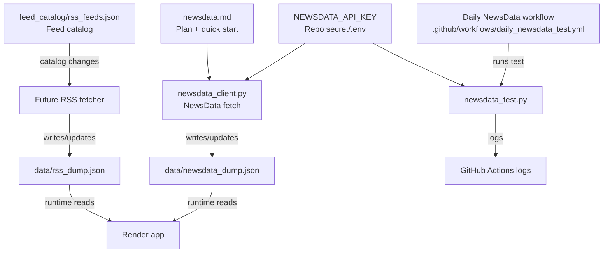
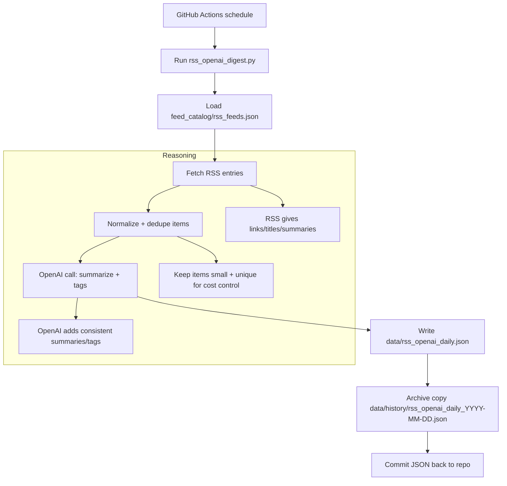

# RSS_Feeds

Catalog and tooling for ingesting RSS feeds and NewsData API results.

## Update Flow (Mermaid)

## Notes
- Daily data refresh without rebuilds: keep dumps in a separate store (GitHub raw, S3/R2, DB) and have the Render app read at runtime.

## Daily RSS OpenAI Digest
- Workflow: `.github/workflows/daily_rss_openai.yml` (runs once per day + manual dispatch).
- Script: `rss_openai_digest.py` reads `feed_catalog/rss_feeds.json`, fetches a small sample of RSS items, calls OpenAI for summaries/tags, and writes `data/rss_openai_daily.json`.
- History: each run also writes a dated copy to `data/history/` (override with `--archive-dir` or disable with `--no-archive`).
- Secrets: add `OPENAI_API_KEY` to repo secrets; optional repo variable `OPENAI_MODEL` (defaults to `gpt-4o-mini`).
- Repo setting: ensure Actions `GITHUB_TOKEN` has read/write permissions so the workflow can commit the JSON.
- Local: create `.env` with `OPENAI_API_KEY` and optional `OPENAI_MODEL`.

### RSS OpenAI Flow (Mermaid)

