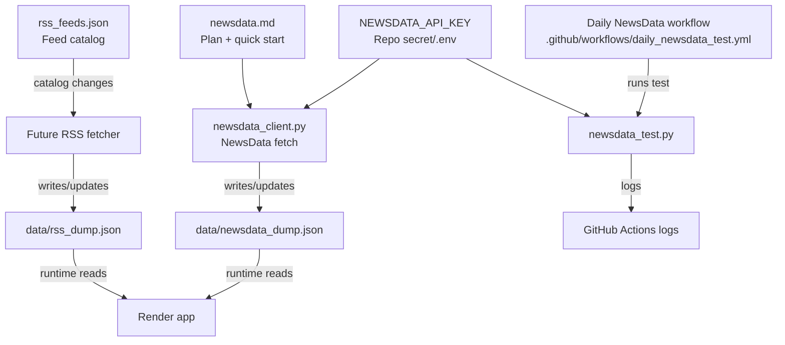

# RSS_Feeds

Catalog and tooling for ingesting RSS feeds and NewsData API results.

## Update Flow (Mermaid)

## Notes
- Daily data refresh without rebuilds: keep dumps in a separate store (GitHub raw, S3/R2, DB) and have the Render app read at runtime.
