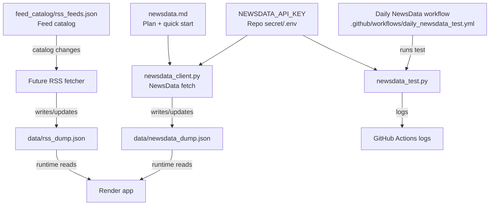
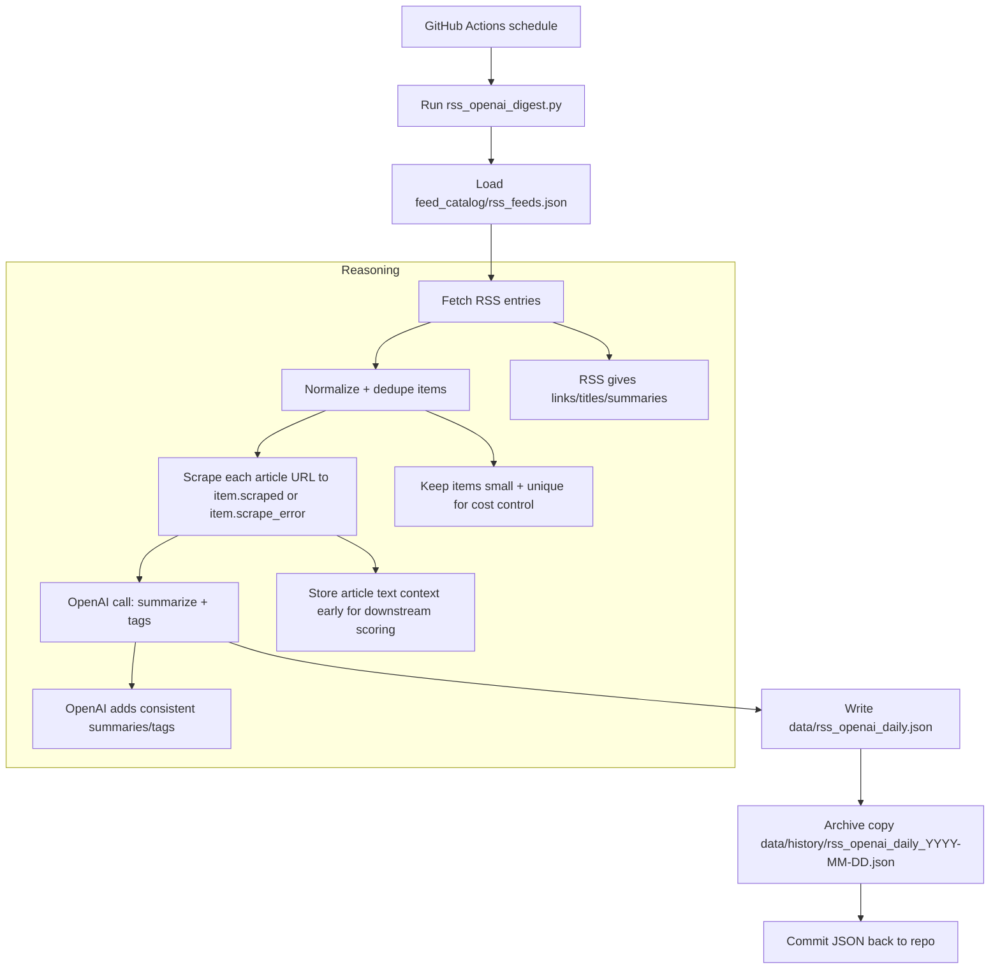

# RSS_Feeds

Catalog and tooling for ingesting RSS feeds and NewsData API results.

## Update Flow (Mermaid)


```mermaid
flowchart TD
    A[feed_catalog/rss_feeds.json\nFeed catalog] -->|catalog changes| B[Future RSS fetcher]
    B -->|writes/updates| C[data/rss_dump.json]

    D[newsdata_client.py\nNewsData fetch] -->|writes/updates| E[data/newsdata_dump.json]
    F[Daily NewsData workflow\n.github/workflows/daily_newsdata_test.yml] -->|runs test| G[newsdata_test.py]
    G -->|logs| H[GitHub Actions logs]
    I[NEWSDATA_API_KEY\nRepo secret/.env] --> D
    I --> G

    C -->|runtime reads| J[Render app]
    E -->|runtime reads| J

    K[newsdata.md\nPlan + quick start] --> D
```

## Notes
- Daily data refresh without rebuilds: keep dumps in a separate store (GitHub raw, S3/R2, DB) and have the Render app read at runtime.

## Daily RSS OpenAI Digest
- Workflow: `.github/workflows/daily_rss_openai.yml` (runs once per day + manual dispatch).
- Script: `rss_openai_digest.py` reads `feed_catalog/rss_feeds.json`, fetches a small sample of RSS items, scrapes each article URL into `item.scraped`/`item.scrape_error`, then calls OpenAI for summaries/tags and writes `data/rss_openai_daily.json`.
- History: each run also writes a dated copy to `data/history/` (override with `--archive-dir` or disable with `--no-archive`).
- Secrets: add `OPENAI_API_KEY` to repo secrets; optional repo variable `OPENAI_MODEL` (defaults to `gpt-4o-mini`).
- Repo setting: ensure Actions `GITHUB_TOKEN` has read/write permissions so the workflow can commit the JSON.
- Local: create `.env` with `OPENAI_API_KEY` and optional `OPENAI_MODEL`.
- Scrape controls: use `--skip-scrape` to disable or adjust scrape settings with `--scrape-limit`, `--scrape-timeout-seconds`, and `--scrape-sleep-seconds`.

### RSS OpenAI Flow (Mermaid)

```mermaid
flowchart TD
    A[GitHub Actions schedule] --> B[Run rss_openai_digest.py]
    B --> C[Load feed_catalog/rss_feeds.json]
    C --> D[Fetch RSS entries]
    D --> E[Normalize + dedupe items]
    E --> F[Scrape each article URL to item.scraped or item.scrape_error]
    F --> G[OpenAI call: summarize + tags]
    G --> H[Write data/rss_openai_daily.json]
    H --> I[Archive copy data/history/rss_openai_daily_YYYY-MM-DD.json]
    I --> J[Commit JSON back to repo]

    subgraph Reasoning
    D --> R1[RSS gives links/titles/summaries]
    E --> R2[Keep items small + unique for cost control]
    F --> R3[Store article text context early for downstream scoring]
    G --> R4[OpenAI adds consistent summaries/tags]
    end
```

## Integrated Analysis Pipeline (from `openaiapi_testing`)
- This repo now includes the loader/scrape/scoring/analysis scripts so you can run the full experiment workflow directly against `data/rss_openai_daily.json`.
- Source-of-truth policy: `RSS_Feeds` is the active repo for this pipeline; `openaiapi_testing` is treated as an archive/read-only snapshot during this consolidation phase.
- Core files added: `load_experiment.py`, `scrape_experiment_links.py`, `run_pre_openai.py`, `score_news_item.py`, `run_post_openai.py`, `lens.py`, `analysis_module/`, `lenses/`.
- Python requirement for these scripts is 3.10+.
- Optional notebook assets are included under `notebooks/` with `requirements-notebooks.txt`.
- Dataclass JSON contract:
  - `from_dict(...)` is backward-compatible/tolerant parsing.
  - `to_dict()` writes canonical JSON shape.
  - `from_json(..., strict=False)` uses compat parsing.
  - `from_json(..., strict=True)` enforces canonical schema with Pydantic `TypeAdapter`.
  - `to_json(...)` validates canonical payloads before encoding.

### Typical local run order
```bash
make rss-openai
make digest-summary
make digest-scrape
make score-openai
make post-openai
```

### Optional notebook setup
```bash
make install-notebooks
```

### External tools (intentional use)
- `feedparser`: RSS ingestion/parsing in `rss_openai_digest.py`.
- `beautifulsoup4`: article HTML extraction in `scrape_experiment_links.py`.
- `openai`: summary/tag and rubric scoring model calls.
- `pydantic TypeAdapter`: strict JSON schema validation + canonical serialization for dataclasses.
- `ruff`: lint and formatting checks for touched pipeline/serialization modules.
- `mypy`: static typing checks for serialization and dataclass contracts.
- `unittest`: deterministic offline contract tests under `tests/`.
- GitHub Actions: scheduled smoke/canary/daily workflows.

### Main inputs and outputs
- Input digest: `data/rss_openai_daily.json`
- Scraped enrichment output: `data/rss_openai_daily_scraped.json`
- Score output: `data/scores.json`
- High-score shortlist: `data/high_scoring_articles.json`
- Analysis outputs: `data/analysis/`

### Validation commands (offline)
```bash
make check-offline
make digest-summary
```

### Validation workflows
- PR/push smoke: `.github/workflows/rss_pipeline_smoke.yml`
  - Runs loader + lens self-tests, serialization contract tests, digest parse smoke, and syntax checks.
- Nightly canary (no OpenAI calls): `.github/workflows/rss_pipeline_canary.yml`
  - Runs tests/self-tests plus pre/post pipeline commands against fixture and snapshot data to catch regressions without paid model usage.
