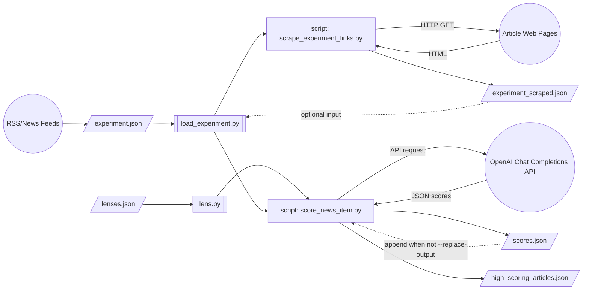
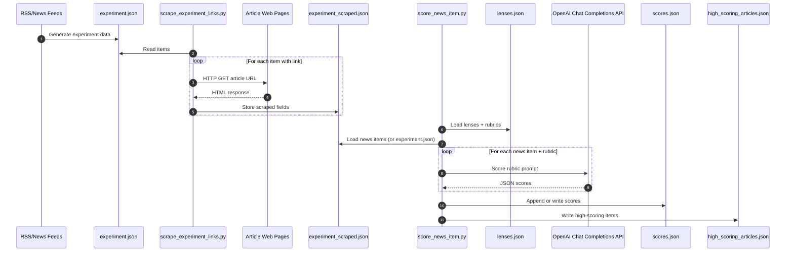
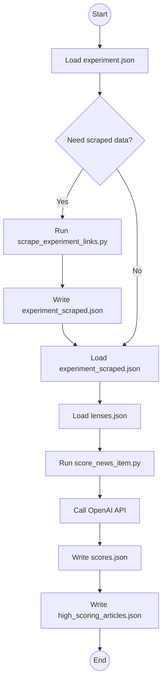

```mermaid
flowchart LR
  ext_feeds((RSS/News Feeds))
  exp_json[/experiment.json/]
  exp_scraped[/experiment_scraped.json/]
  lenses[/lenses.json/]
  scores[/scores.json/]
  high_scores[/high_scoring_articles.json/]

  load_py[[load_experiment.py]]
  scrape_py[script: scrape_experiment_links.py]
  score_py[script: score_news_item.py]
  lens_py[[lens.py]]

  article_pages((Article Web Pages))
  openai((OpenAI Chat Completions API))

  ext_feeds --> exp_json

  exp_json --> load_py
  load_py --> scrape_py
  scrape_py -- "HTTP GET" --> article_pages
  article_pages -- "HTML" --> scrape_py
  scrape_py --> exp_scraped

  exp_scraped -. "optional input" .-> load_py
  lenses --> lens_py
  lens_py --> score_py
  load_py --> score_py
  scores -. "append when not --replace-output" .-> score_py

  score_py -- "API request" --> openai
  openai -- "JSON scores" --> score_py
  score_py --> scores
  score_py --> high_scores
```

```mermaid
sequenceDiagram
  autonumber
  participant Feeds as RSS/News Feeds
  participant Exp as experiment.json
  participant Scrape as scrape_experiment_links.py
  participant Pages as Article Web Pages
  participant ExpScraped as experiment_scraped.json
  participant Score as score_news_item.py
  participant Lenses as lenses.json
  participant OpenAI as OpenAI Chat Completions API
  participant Scores as scores.json
  participant High as high_scoring_articles.json

  Feeds->>Exp: Generate experiment data
  Scrape->>Exp: Read items
  loop For each item with link
    Scrape->>Pages: HTTP GET article URL
    Pages-->>Scrape: HTML response
    Scrape->>ExpScraped: Store scraped fields
  end

  Score->>Lenses: Load lenses + rubrics
  Score->>ExpScraped: Load news items (or experiment.json)
  loop For each news item + rubric
    Score->>OpenAI: Score rubric prompt
    OpenAI-->>Score: JSON scores
  end
  Score->>Scores: Append or write scores
  Score->>High: Write high-scoring items
```

```mermaid
flowchart TD
  start((Start))
  load_exp[Load experiment.json]
  decide_scrape{Need scraped data?}
  scrape[Run scrape_experiment_links.py]
  write_scraped[Write experiment_scraped.json]
  load_scraped[Load experiment_scraped.json]
  load_lenses[Load lenses.json]
  score_items[Run score_news_item.py]
  call_api[Call OpenAI API]
  write_scores[Write scores.json]
  write_high[Write high_scoring_articles.json]
  end_node((End))

  start --> load_exp --> decide_scrape 
  decide_scrape -- Yes --> scrape --> write_scraped --> load_scraped
  decide_scrape -- No --> load_scraped
  load_scraped --> load_lenses --> score_items
  score_items --> call_api --> write_scores --> write_high --> end_node
```
