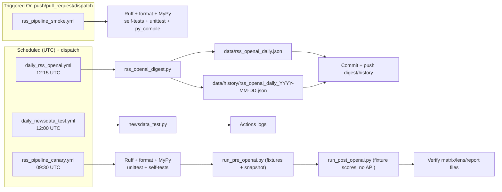
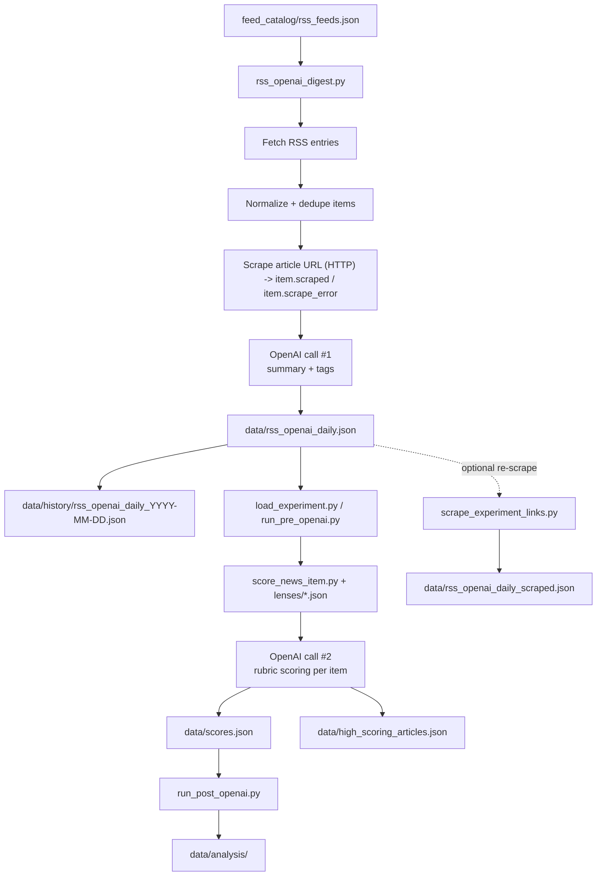
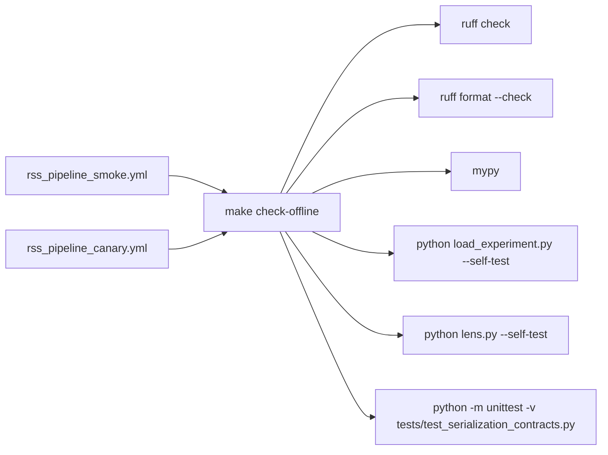

# RSS_Feeds Workflow Diagrams

## 1) GitHub Actions Topology

```mermaid
flowchart LR
  subgraph Triggered["Triggered On push/pull_request/dispatch"]
    Smoke["rss_pipeline_smoke.yml"]
  end

  subgraph Scheduled["Scheduled (UTC) + dispatch"]
    DailyDigest["daily_rss_openai.yml\n12:15 UTC"]
    NewsData["daily_newsdata_test.yml\n12:00 UTC"]
    Canary["rss_pipeline_canary.yml\n09:30 UTC"]
  end

  Smoke --> SmokeChecks["Ruff + format + MyPy\nself-tests + unittest + py_compile"]

  DailyDigest --> DigestRun["rss_openai_digest.py"]
  DigestRun --> DigestOut["data/rss_openai_daily.json"]
  DigestRun --> DigestHist["data/history/rss_openai_daily_YYYY-MM-DD.json"]
  DigestOut --> DigestCommit["Commit + push digest/history"]
  DigestHist --> DigestCommit

  NewsData --> NewsDataRun["newsdata_test.py"]
  NewsDataRun --> NewsDataLogs["Actions logs"]

  Canary --> CanaryChecks["Ruff + format + MyPy\nunittest + self-tests"]
  CanaryChecks --> CanaryPre["run_pre_openai.py (fixtures + snapshot)"]
  CanaryPre --> CanaryPost["run_post_openai.py (fixture scores, no API)"]
  CanaryPost --> CanaryVerify["Verify matrix/lens/report files"]
```

## 2) Data Pipeline + OpenAI Call Points

```mermaid
flowchart TD
  Catalog["feed_catalog/rss_feeds.json"] --> Digest["rss_openai_digest.py"]
  Digest --> Fetch["Fetch RSS entries"]
  Fetch --> Normalize["Normalize + dedupe items"]
  Normalize --> Scrape["Scrape article URL (HTTP) -> item.scraped / item.scrape_error"]
  Scrape --> Summarize["OpenAI call #1\nsummary + tags"]
  Summarize --> Daily["data/rss_openai_daily.json"]
  Daily --> History["data/history/rss_openai_daily_YYYY-MM-DD.json"]

  Daily --> Loader["load_experiment.py / run_pre_openai.py"]
  Loader --> Score["score_news_item.py + lenses/*.json"]
  Score --> ScoreAPI["OpenAI call #2\nrubric scoring per item"]
  ScoreAPI --> Scores["data/scores.json"]
  ScoreAPI --> High["data/high_scoring_articles.json"]
  Scores --> Post["run_post_openai.py"]
  Post --> Analysis["data/analysis/"]

  Daily -. optional re-scrape .-> Rescrape["scrape_experiment_links.py"]
  Rescrape --> ScrapedOut["data/rss_openai_daily_scraped.json"]
```

## 3) Local/CI Quality Gate Flow

```mermaid
flowchart LR
  Check["make check-offline"] --> Lint["ruff check"]
  Check --> Format["ruff format --check"]
  Check --> Types["mypy"]
  Check --> SelfA["python load_experiment.py --self-test"]
  Check --> SelfB["python lens.py --self-test"]
  Check --> Contracts["python -m unittest -v tests/test_serialization_contracts.py"]

  SmokeCI["rss_pipeline_smoke.yml"] --> Check
  CanaryCI["rss_pipeline_canary.yml"] --> Check
```
