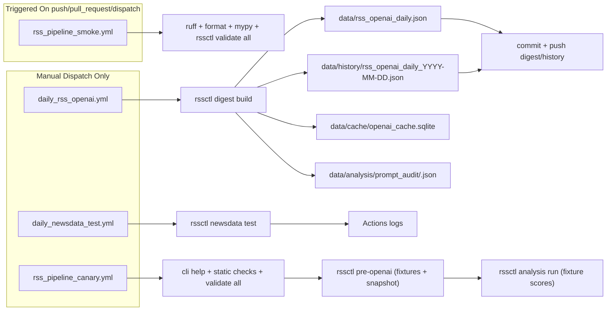
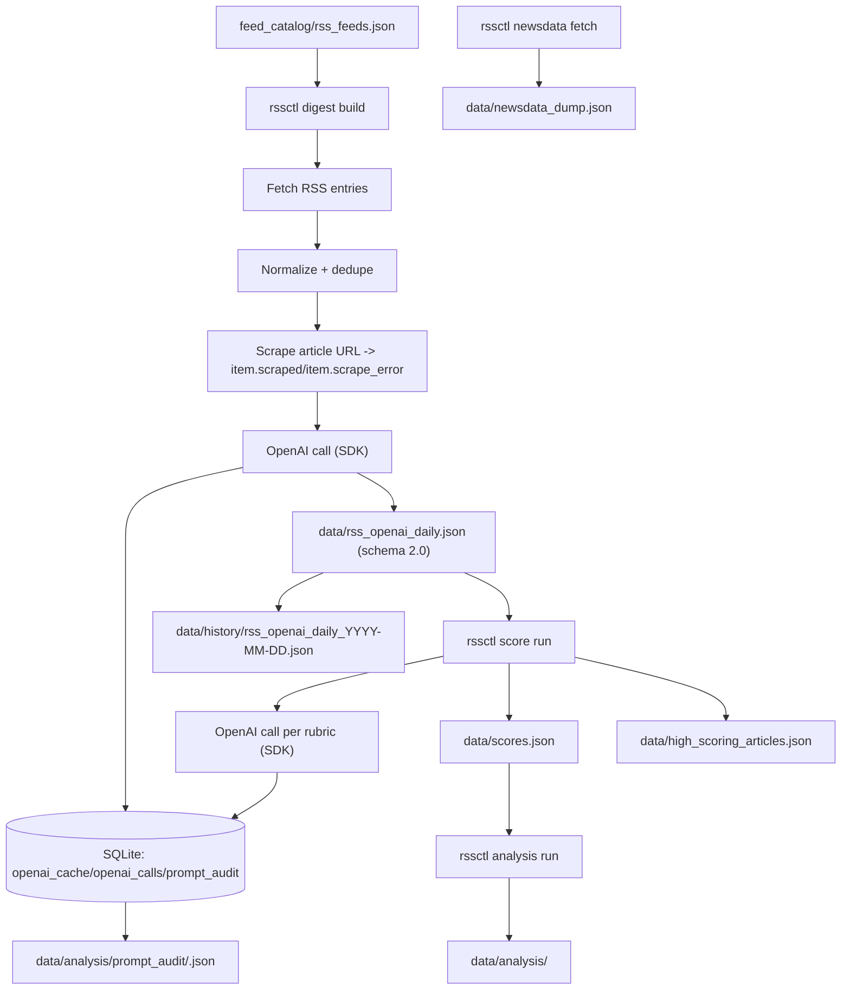
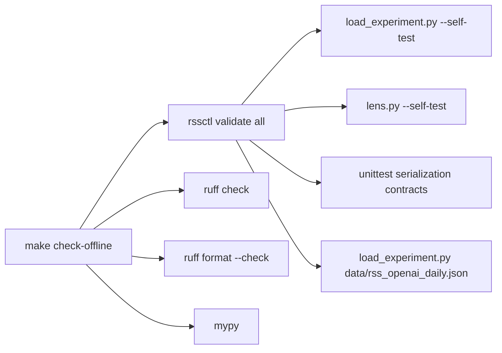

# RSS_Feeds Workflow Diagrams

## 1) GitHub Actions Topology (Migration Phase)

```mermaid
flowchart LR
  subgraph Triggered["Triggered On push/pull_request/dispatch"]
    Smoke["rss_pipeline_smoke.yml"]
  end

  subgraph ManualOnly["Manual Dispatch Only"]
    DailyDigest["daily_rss_openai.yml"]
    NewsData["daily_newsdata_test.yml"]
    Canary["rss_pipeline_canary.yml"]
  end

  Smoke --> SmokeChecks["ruff + format + mypy + rssctl validate all"]

  DailyDigest --> DigestRun["rssctl digest build"]
  DigestRun --> DigestOut["data/rss_openai_daily.json"]
  DigestRun --> DigestHist["data/history/rss_openai_daily_YYYY-MM-DD.json"]
  DigestRun --> CacheDB["data/cache/openai_cache.sqlite"]
  DigestRun --> PromptAudit["data/analysis/prompt_audit/<run_id>.json"]
  DigestOut --> DigestCommit["commit + push digest/history"]
  DigestHist --> DigestCommit

  NewsData --> NewsDataRun["rssctl newsdata test"]
  NewsDataRun --> NewsDataLogs["Actions logs"]

  Canary --> CanaryChecks["cli help + static checks + validate all"]
  CanaryChecks --> CanaryPre["rssctl pre-openai (fixtures + snapshot)"]
  CanaryPre --> CanaryPost["rssctl analysis run (fixture scores)"]
```

## 2) Unified `rssctl` Pipeline + Audit/Caching

```mermaid
flowchart TD
  Catalog["feed_catalog/rss_feeds.json"] --> Digest["rssctl digest build"]
  Digest --> Fetch["Fetch RSS entries"]
  Fetch --> Normalize["Normalize + dedupe"]
  Normalize --> Scrape["Scrape article URL -> item.scraped/item.scrape_error"]
  Scrape --> Summarize["OpenAI call (SDK)"]
  Summarize --> Cache[("SQLite: openai_cache/openai_calls/prompt_audit")]
  Summarize --> Daily["data/rss_openai_daily.json (schema 2.0)"]
  Daily --> History["data/history/rss_openai_daily_YYYY-MM-DD.json"]
  Cache --> PromptExport["data/analysis/prompt_audit/<run_id>.json"]

  Daily --> Score["rssctl score run"]
  Score --> ScoreOpenAI["OpenAI call per rubric (SDK)"]
  ScoreOpenAI --> Cache
  Score --> Scores["data/scores.json"]
  Score --> High["data/high_scoring_articles.json"]

  Scores --> Analysis["rssctl analysis run"]
  Analysis --> AnalysisOut["data/analysis/"]

  NewsDataFetch["rssctl newsdata fetch"] --> NewsDataDump["data/newsdata_dump.json"]
```

## 3) Offline Validation Contract

```mermaid
flowchart LR
  Validate["rssctl validate all"] --> LoaderSelf["load_experiment.py --self-test"]
  Validate --> LensSelf["lens.py --self-test"]
  Validate --> Contracts["unittest serialization contracts"]
  Validate --> DigestParse["load_experiment.py data/rss_openai_daily.json"]

  MakeCheck["make check-offline"] --> Lint["ruff check"]
  MakeCheck --> Format["ruff format --check"]
  MakeCheck --> Type["mypy"]
  MakeCheck --> Validate
```
